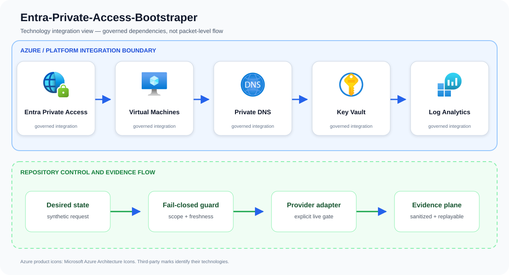

# Entra-Private-Access-Bootstraper

Automate a secure baseline for publishing legacy private applications through Entra Private Access.

## Problem statement

A legacy application request is converted into a guarded connector and private-access plan with tenant allow-listing, secretless administration, explicit production approval, and private DNS expectations.

A production implementation can still fail even when every resource deploys successfully. The material risk is invisible trust expansion: a subject, tenant, group, or session gains access beyond the exact relationship its owner approved. The design therefore treats Entra Private Access, Virtual Machines, Private DNS, and the surrounding identity and evidence controls as one reviewable system rather than unrelated configuration tasks.

## Example case study

### Situation

A company must expose an internal HR application to remote employees without opening inbound firewall ports or extending the corporate VPN. The bootstrapper places Entra identity and Conditional Access in front of the private application.

### Response

A company replaces broad VPN access to a legacy internal application. Connectors, application segments, identity policy, DNS, and health monitoring let users reach only the named application instead of the surrounding network.

The team first exercises the repository's synthetic approved and denied fixtures. An approved request must produce the same idempotent plan on replay; a stale, unscoped, public, or unapproved request must fail before an Azure adapter is allowed to run.

### Expected outcome

Stakeholders receive a decision package they can attach to a change record: requested scope, controls evaluated, the reason for approval or denial, and the explicit handoff to live integration. The example supports design review and incident rehearsal without pretending that a local test changed Azure.

## Architecture

IaC creates connector networks, hardened connector VMs, DNS dependencies, managed identities, Key Vault integration, application segments, and Entra access assignments. Conditional Access governs authenticated access without inbound exposure.

Primary services: `Entra Private Access`, `Virtual Machines`, `Private DNS`, `Key Vault`.

This repository implements the first production-oriented vertical slice: a
fail-closed, adapter-neutral control plane that validates tenant scope,
freshness, approvals, secretless identity, private access, and the exact
project action before producing a deterministic execution plan. Azure adapters
consume that plan; they are deliberately outside the local simulator so local
tests cannot claim a live cloud change occurred.



The upper boundary names the principal services and technologies used by this repository. The lower boundary shows the implemented control flow: desired state is validated, provider action remains an explicit integration gate, and sanitized evidence is retained for review and deterministic replay.

## Quickstart

Requirements: Python 3.11+ and Git. No Azure credentials are required.

```bash
./scripts/validate.sh
python3 src/control_plane.py --request examples/approved-request.json
```

The command emits canonical JSON with a stable idempotency key. The denied
fixture exits with status 2 and explains the failed invariants.

## Security boundaries

- Managed identity or workload identity only; embedded credentials are denied.
- Public network access and stale evidence are denied.
- Production and break-glass targets require explicit approval.
- The IaC entry point is opt-in and defaults to deploying nothing.
- Evidence output contains identifiers and decisions, never credential values.

## Verification and limitations

Local validation covers 13 tests, deterministic replay, JSON parsing, Python
compilation, ignore hygiene, and Bicep compilation when a compiler is present.
It does **not** prove Azure deployment, service licensing, quota, data-plane
permissions, provider/API availability, cloud failover, load, cost, or teardown.
See [`docs/test-matrix.md`](docs/test-matrix.md) and [`docs/runbook.md`](docs/runbook.md) before any integration trial.

## Community

See [`CONTRIBUTING.md`](CONTRIBUTING.md), [`SECURITY.md`](SECURITY.md), [`SUPPORT.md`](SUPPORT.md), and [`LICENSE`](LICENSE). The reference
is intentionally conservative and uses synthetic identifiers only.

## Repository guide

- [Architecture](docs/architecture.md)
- [Threat model](docs/threat-model.md)
- [Operations runbook](docs/runbook.md)
- [Test matrix](docs/test-matrix.md)
- [Cost model](docs/cost-model.md)
- [Security policy](SECURITY.md)
- [Contributing guide](CONTRIBUTING.md)
- [Support policy](SUPPORT.md)
- [Changelog](CHANGELOG.md)
- [License](LICENSE)

## Infrastructure inputs

Resource behavior and deploy-time values are intentionally separated:

- [Bicep template](infra/main.bicep) — Azure resources, modules, and security controls.
- [Bicep parameters](infra/main.bicepparam) — environment-specific names, regions, identities, and feature inputs.

Start with the parameter file's safe values, replace synthetic identifiers, and run an Azure what-if before deployment.

## Attribution

Azure product icons come from [Microsoft's official Azure Architecture Icons](https://learn.microsoft.com/azure/architecture/icons/). Open-source marks are sourced from [Simple Icons](https://simpleicons.org/) when shown; each mark identifies its respective technology.
